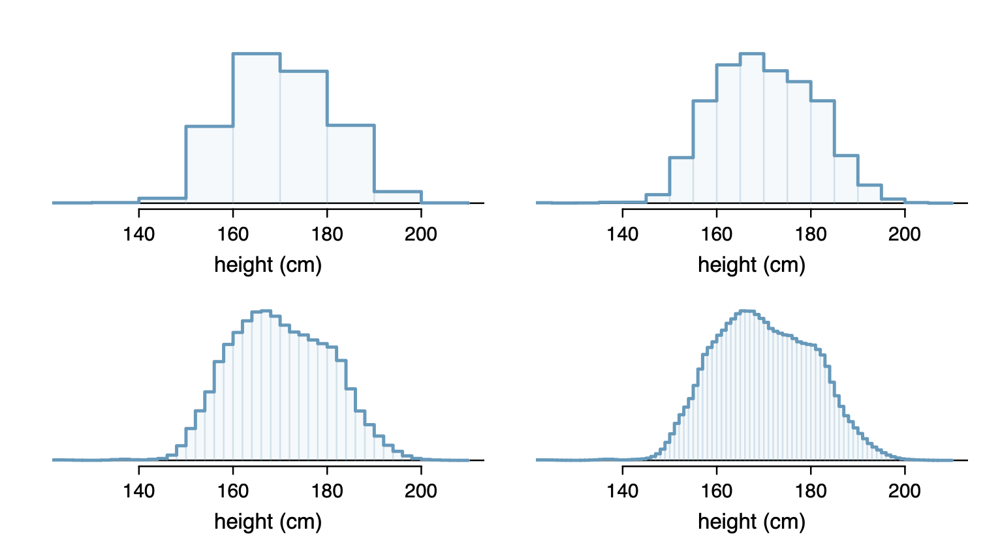
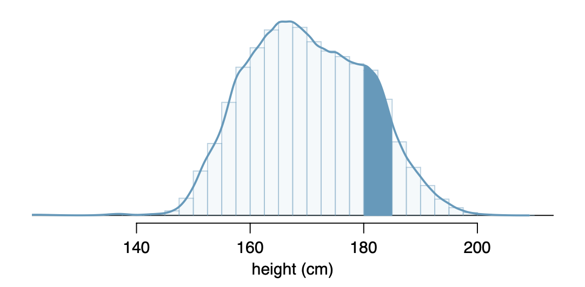

```{r global_options, include = FALSE}
library(knitr)
library(tidyverse)
knitr::opts_chunk$set(eval = TRUE, results = TRUE)
```

------------------------------------------------------------------------

## Today's Agenda

-   Continuous Distribution
-   Uniform Distribution

------------------------------------------------------------------------

## Continuous Distribution

-   When data is numeric continuous, we can often make the bins of a histogram extremely small and still have a very readable graph

eg.



-   Notice that the thick blue line at the top of the histograms smooths out as you add more bins
-   For numeric continuous data, it is often more appropriate to think of the probability distribution as a smooth curve.
-   The area under the curve between certain values tells you the probability of a randomly selected data point falling in that range.
-   The curve is called a **probability density function**
-   the y-axis no longet tells you the probability of a bin, it tells you the "density"



-   Since any particular event only makes a line in a continuous probability distribution, the probability of that event is 0.
-   Think about the probability that the average temperature tomorrow will be 80.0000... degrees.
-   This is impossible since it could instead be 80.0001 or 80.0002, and infinitely many other things.
-   If they all had a probability greater than 0 and we added them all up, the total probability distribution would exceed 1, which is bad!
-   

## Uniform Distribution

-   Both continuous and discrete probability distributions can be uniform since the main characteristic of a uniform distribution is that all outcomes are equally likely.

-   The notation for a random variable $X$ following a uniform distribution is

$$X \sim U(a,b)$$

-   where $a$ and $b$ represent the possible range possible values that $X$ can take on

-   In a uniform distribution for a continuous random variable, the probability distribution is a rectangle

-   The **pdf** (probability density function) for a uniformly distributed random variable is:

$$
f(x) = \frac{1}{b-a}
$$

for $a \leq x \leq b$.
