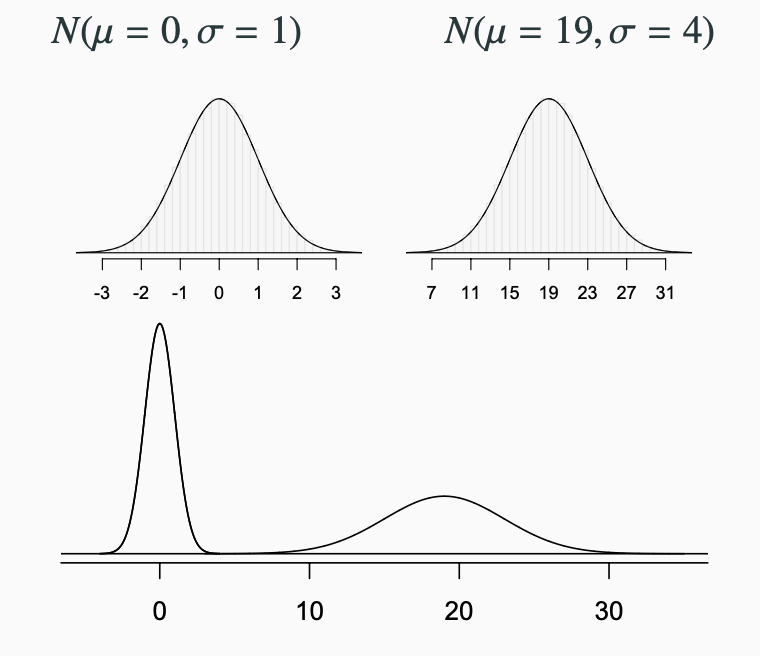

```{r global_options, include = FALSE}
library(knitr)
library(tidyverse)
library(dplyr)
knitr::opts_chunk$set(eval = TRUE, results = TRUE)
```

------------------------------------------------------------------------

## Today's Agenda

- Normal Distribution
- Difference between vectors and data frames
- Sampling Distribution

------------------------------------------------------------------------

## Normal Distribution

-   Recall that a **normally distributed** random variable is denoted by

$$X \sim N(\mu,\sigma)$$

where $\mu$ and $\sigma$ are the mean and standard deviation of $X$ respectively.

-   $\mu$ is the center and shifts the distribution
-   $\sigma$ is the spread and it will flatten or compress the curve



## Difference between vectors and dataframes 


## Sampling Distribution

```{r}
# Make a uniform distribution
# a school has 5000 students, suppose each GPA is equally likely to occur
students <- data.frame(id= seq(1,5000,1),GPA = runif(5000, 0, 4))

```

